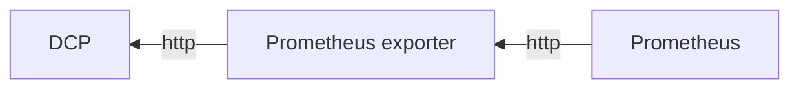

# ericsson-dcp-exporter

## Description

>Ericsson Device Connection Platform Prometheus exporter.

## Metrics

### DCP

| Metric | type | Description | labels | value | implemented |
| --- | --- | -- | -- | -- | -- |
| api_status | gauge | API status as a boolean value (1 = true, 0 = false) | N/A | bool | ✅ |
| dcp_scrape_duration_seconds | gauge | Duration for the exporter to go through all it's main function (not counting go routine) | N/A | int | ✅ |
| dcp_scrape_error | gauge | Whether the last scrape of metrics from the DCP resulted in an error (0 for error, 1 for success) | N/A | bool | ✅ |

### sim inventory

| Metric | type | Description | labels | value | implemented |
| --- | --- | -- | -- | -- | -- |
| sim_volume | gauge | Number of sim cards in the system | N/A | int | ❌ |
| sim_inventory_status | gauge | Number of SIMs in inventory by status. | status | int | ❌ |
| sim_inventory_subscription | gauge | Number of SIMs in inventory by subscription. | subscription | int | ❌ |

### sim details

| Metric | type | Description | labels | value | implemented |
| --- | --- | -- | -- | -- | -- |
| sim_details | gauge | Detail information about a specific SIM |  subscription, name, IMSI, MSISDN, ICCID, IMEI_D, IMEI_A | status | ❌ |
| sim_comsumption_30d | gauge | SIM comsumption the last 30d, will be present only if the SIM status is Active | subscription, name, ICCD | comsumption | ❌ |
| sim_comsumption_7d | gauge | SIM comsumption for the last 7d, will be present only if the SIM status is Active | subscription, name, ICCD | comsumption | ❌ |
| sim_comsumption_24h | gauge | SIM comsumption for the last 24h, will be present only if the SIM status is Active | subscription, name, ICCD | comsumption | ❌ |

For these metrics, `status` stated in the value field corresponds to the following:

| status | Description |
| --- | --- |
| 0 | ACTIVE |
| 1 | INACTIVE |
| 2 | SUSPENDED |
| 3 | DELETED |

## Labels

| Label | Description | Values detail | metric applied |
| --- | --- | --- | --- |
| status | SIM status | STRING =  ACTIVE, INACTIVE, SUSPENDED, DELETED | sim_inventory_status |
| subscription | ID of the subscription that the SIM is link to | STRING (with _ as separator)  | sim_inventory_subscription |
| name | Name of the SIM | STRING | sim_details |
| IMSI | IMSI of the SIM | STRING | sim_details |
| MSISDN | MSISDN of the SIM | STRING | sim_details |
| ICCID | ICCID of the SIM | STRING | sim_details |
| IMEI_D | IMEI Dectected on the SIM | STRING | sim_details |
| IMEI_A | IMEI Attributed for the SIM | STRING | sim_details |

## Diagram

